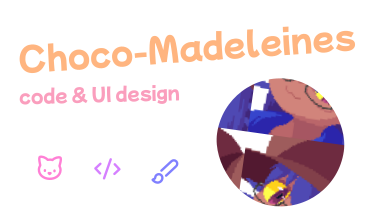

 

    

 

<h1 align="center">🐈‍⬛ About myself:</h1>

    Self-taught developer, High-school student, living in France, 
    Computers are my passion ever since I was young, I also enjoy art, 
    I treat web development and UI/UX design, as a form of art, 
    I like to experiment, I like to make my creations unique.

<h3 align="center">🖌️ Tools/Languages I use:</h3>

    HTML, CSS/<a href="https://sass-lang.com/">SCSS</a>, JS, PHP, <a href="https://twig.symfony.com/">Twig</a>, C, <a href="https://www.raylib.com/">Raylib</a>, Linux, <a href="https://figma.com">Figma</a>.

<h3 align="center">📖 Currently learning:</h3>

    C, GLSL, German language 🇩🇪.

 

<h1 align="center">✉️ How to contact me:</h1>

    You can send me E-Mails: <a href="mailto:chocomadeleines@proton.me">chocomadeleines@proton.me</a>

 
<h6 align="center">miao~ 🐈‍⬛ :3</h6>
